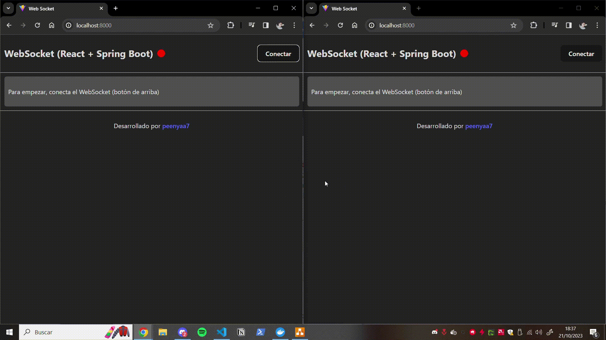

# Web Socket con Spring y React

Ejemplo de conexión Web Socket entre Spring (como servidor) y React (como cliente).
Incluye explicaciones.



## Información

| Servidor | Cliente |
| :---: | :---: |
| Java 17 | Node 18.17.1 |
| Spring Boot 2.7.16 | Yarn 1.22.19 |
| Maven 3.8.7 | React 18.2.0 |
| | SockJS 1.6.1 |
| | STOMP 2.3.3 |


[TOC]

## Explicación

### 1. Web Socket

Web Socket es un protocolo de comunicación bidireccional, full-duplex, sobre un único socket TCP. Es decir, permite la comunicación entre cliente y servidor en tiempo real. 

### 2. SockJS

SockJS hace que Web Socket sea compatible con navegadores y servidores antiguos. Es decir, SockJS es una librería que permite la comunicación bidireccional entre cliente y servidor en tiempo real, incluso en navegadores y servidores antiguos.

¿Cómo lo hace? SockJS utiliza Web Socket si el navegador y el servidor lo soportan. Si no lo soportan, SockJS utiliza otras técnicas como long polling, polling, etc.

### 3. STOMP

STOMP es un protocolo de mensajería simple, que permite la comunicación entre cliente y servidor en tiempo real. Es decir, STOMP es un protocolo de mensajería que funciona sobre Web Socket.

STOMP nos permite enviar y recibir mensajes en formato JSON sin tener que preocuparnos por el formato de los mensajes. Además, nos permite habilitar varios canales de comunicación (topics) para que los clientes se suscriban a ellos, mientras que con Web Socket en crudo solo podemos enviar y recibir mensajes a un único @Controller.

### 4. Spring Web Socket

Spring Web Socket es un módulo de Spring que nos permite implementar Web Socket en el servidor. Además, Spring Web Socket nos permite implementar STOMP y SockJS.

## Configuración

### 1. Servidor

#### 1.1. Dependencias

```xml
<dependency>
    <groupId>org.springframework.boot</groupId>
    <artifactId>spring-boot-starter-websocket</artifactId>
</dependency>
```

#### 1.2. Configuración (habilitar Web Socket, STOMP y SockJS)

```java
import org.springframework.context.annotation.Configuration;
import org.springframework.messaging.simp.config.MessageBrokerRegistry;
import org.springframework.web.socket.config.annotation.EnableWebSocketMessageBroker;
import org.springframework.web.socket.config.annotation.StompEndpointRegistry;
import org.springframework.web.socket.config.annotation.WebSocketMessageBrokerConfigurer;

@Configuration
@EnableWebSocketMessageBroker
public class WebSocketConfig implements WebSocketMessageBrokerConfigurer {

	@Override
	public void registerStompEndpoints(StompEndpointRegistry registry) {

        /**
         * Habilitamos el endpoint /ws para que los clientes se conecten a él.
         * El método withSockJS() permite que el endpoint sea accesible por clientes que no soportan WebSockets.
         */

		registry
            .addEndpoint("/ws")
            .setAllowedOriginPatterns("*")
            .withSockJS();
	}

	@Override
	public void configureMessageBroker(MessageBrokerRegistry config) {

        /**
         * Habilitamos un simple broker en memoria para que los clientes puedan suscribirse a los mensajes.
         * Los prefijos de destino de la aplicación se establecen en /app y los prefijos de destino del broker se establecen en /topic y /queue.
         * Los prefijos de destino de la aplicación se utilizan para enrutar mensajes entrantes desde clientes a métodos de controlador de mensajes anotados con @MessageMapping.
         * Los prefijos de destino del broker se utilizan para enrutar mensajes desde el broker a los clientes.
         */

		config.setApplicationDestinationPrefixes("/app"); 
		config.enableSimpleBroker("/topic", "/queue"); 
	}
}
```

### 2. Cliente

#### 2.1. Dependencias

```json
"dependencies": {
    "stompjs": "2.3.3",
    "sockjs-client": "1.6.1",
},
"devDependencies": {
    "@types/sockjs-client": "1.5.2",
    "@types/stompjs": "2.3.6",
}
```

## Ejecución del proyecto

Descargamos el proyecto

```bash
git clone https://github.com/peenyaa7/spring-react-web-sockets.git
```

### 1. Ejecución con Docker 🐳

```bash
docker-compose up -d
```

Este comando ejecuta el servidor y el cliente sin tener que instalar nada en local. Para acceder al cliente, abrir el navegador en http://localhost


### 2. Ejecución en local

Para ejecutar el servidor:

```bash
cd server-spring-2.7.16
.\mvnw.cmd spring-boot:run
```

Para ejecutar el cliente:

```bash
cd client-react
yarn run dev
```

Para acceder al cliente, abrir el navegador en http://localhost:8000

## Uso

### 1. Recibir mensajes cada 5 segundos

En el servidor existe una tarea programada que envía un mensaje cada 5 segundos a todos los clientes suscritos al topic `/topic/scheduled`. Prueba a subscribirte a este topic para recibir los mensajes.

**NOTA**: Puedes subscribirte a un mismo topic cuantas veces quieras, cada subscripción es independiente.

### 2. Enviar mensajes entre varios clientes

Accede a la aplicación desde varios clientes (es decir, desde varias pestañas del navegador, varios navegadores o varios dispositivos de la red local). Subscríbete al cualquier topic que comience con `/topic` o `/queue` y envía un mensaje a ese topic. Todos los clientes suscritos a ese topic recibirán el mensaje.

### 3. Topics no disponibles

En la configuración del servidor, se ha habilitado un broker en memoria con los topics que tiene el prefijo `/topic` y `/queue`. Si intentas subscribirte a un topic que no tiene este prefijo, no ocurrirá nada. Es decir, no se mostrará ningún error en la consola del navegador ni en la consola del servidor. Tampoco se mostrará ningún mensaje cuando se envíe un mensaje a ese topic.

Prueba a subscribirte a un topic que no tiene el prefijo `/topic` ni `/queue` con varios clientes y envía un mensaje a ese topic. No ocurrirá nada.

## Resolución de problemas

### 1. global is not defined

Añadir en el head del index.html

```html
<script type="application/javascript">
    var global = window;
</script>
```